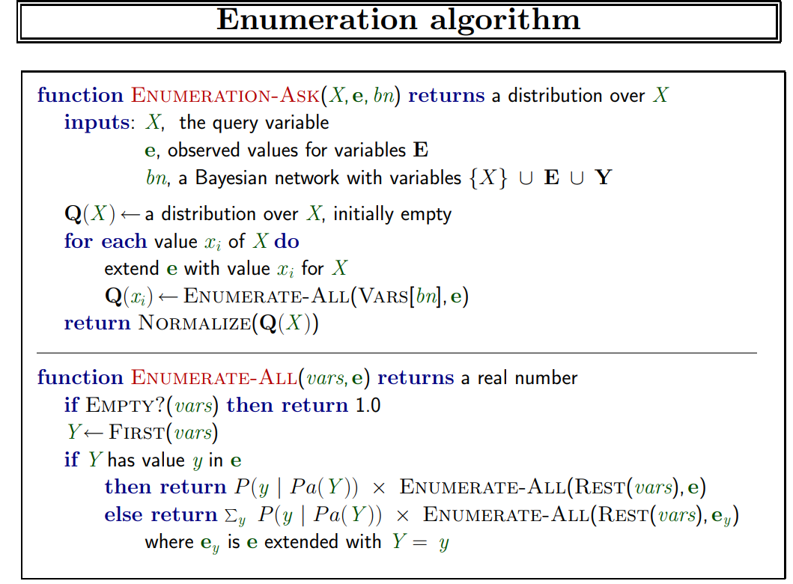

assignment 3:

inside this project we have a folder named Example_Outputs
in which we have 2 examples of (input + output + commands to run the program)

to build a bayes network , we have one global random var for weather that can get 3 values.
and it have no parent nodes.

then in the second level in the tree we have one boolean variable for each edge in the input graph , indicating whether current edge is flooded or not.
all of these nodes have weather node as their parent. -> F_i nodes

then in the last level we have one boolean variable for each node in the
input graph indicating whether this node have people to be rescued or not.
this nodes are name , Ev_i nodes
every Ev_i node have a link to its edges.

inference:

for inference algorithm we used simple enumartion algorithm taught in class.

with one simple improvment -> we have removed every Ev_i node which does not appear in Query or evidence variable 
as they are in the last level of the tree and in such case the calculation is independent from Ev_i val.
